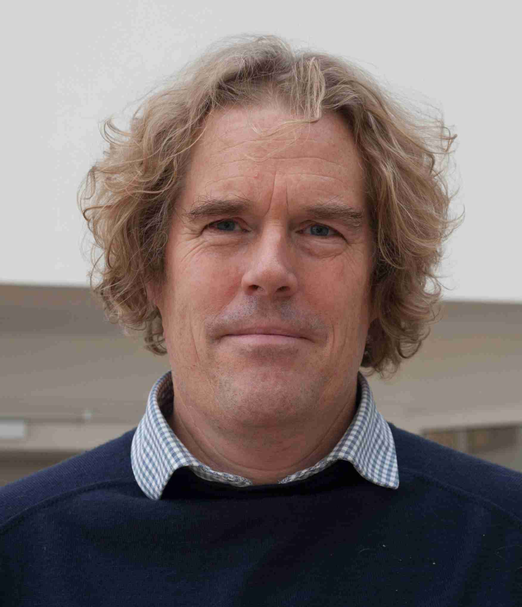

## Om meg

Navnet mitt er Reier. Det er et gammelt norsk navn.

- TechReier liker å surre med datasystemer.  
- TechReier har en fokus på fornuftig bruk av teknologi.
- TechReier advarer mot feil bruk av teknologi.
- TechReier er engasjert i energipolitikk og skattepolitikk, naturtap og klimaendringer.
- TechReier har redaktør ansvaret selv.
- TechReier kan gjerne forklare hvordan ting er laget.  
- TechReier refererer til pålitelige kilder.
- TechReier samarbeider med andre fagpersoner i smidige produkt team.

Derfor dette blogg inspirerte nettstedet.
Ikke sponset av noe firma.

Jeg er en senior programvareutvikler som bor på Moelv, Innlandet Norge med kvinnelig samboer.
Jeg liker meg også ute i naturen, med turer, løping, skigåing og orientering.
Vi har en stor hage, med plen, bær og bærbusker, noen frukt trær og utsikt over Mjøsa.

Min epost adresse er: reier.sigmond@gmail.com

